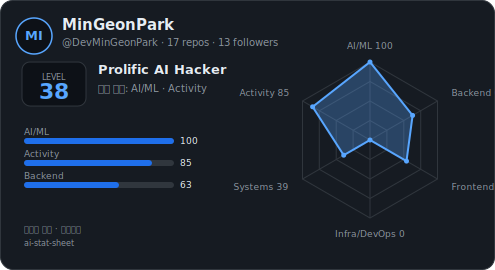

[한국어](README.md) | English

## Mingeon Park

**Applied AI Engineer.** I don't just solve given problems — I define problems on the ground, solve them in code, and prove the result.
From LLM reliability (RAG, agents) to full-stack products, I ship the system and write the research behind it.

  

A stat card scoring my GitHub activity, generated by my own <a href="https://github.com/DevMinGeonPark/ai-stat-sheet">ai-stat-sheet</a>.

### Focus
- **LLM reliability & agents** — RAG, tool use, eval, HITL; trustworthy AI that blocks hallucination by design (main interest)
- **Full-stack / E2E** — FE·BE·AI·infra·deploy·ops, TypeScript / React / Next.js / Go / Python, production-grade
- **Applied ML** — EEG decoding, vision-language grounding, anomaly detection

### Experience
- **Applied AI Engineer @ Qbiotech** — 2025.9 – present. Solo-built **14+ microservices** including a legal-RAG safety-document pipeline and a BFD generation/verification agent
- **AI Research Intern @ KITECH, Manufacturing AI Center** — 2025.4 – 2025.7. Semiconductor CMP defect detection (YOLOv8 mAP50 ~99%)
- **Master's @ Sejong Univ., ISLab (Information Security)** — 2024 (left to move into AI). RoIFuzz — a ROS IDL fuzzer; CISC-W'24 oral talk · patent · SW registration
- **Full-stack Freelance Developer** — 2020 – 2024. Planning to app-store release and ops, solo. KT FineGst sales app (3,000+ users, still maintained), etc.
- **Frontend Intern @ Momit** — Next.js admin refactor (2023)
- **Coding Instructor** — Elice (Python/algorithms), Im4u Gifted Academy (C / olympiad), Hyundai Motor VE+AI lecture

### Talks & Patents
- **EEG2Diff** — latent-diffusion neural decoding; oral talk, Korea Intelligent Information Systems Society, Spring 2023
- **RoIFuzz** — ROS IDL fuzzer with a hardened security policy; oral talk, CISC-W'24
- 2 patent applications (job-experience curation · robot SW testing) · 1 SW registration

### Selected work
**AI-native dev tools (built by me)**
| | |
|---|---|
| [rite](https://github.com/DevMinGeonPark/rite) | Artifact-first AI dev-team manager for Claude Code & Codex — no evidence, no done |
| [amux](https://github.com/DevMinGeonPark/amux) | Agent-aware tmux session manager — see what each session runs and its live status (working/needs-you/asking/idle) |
| [gaejo](https://github.com/DevMinGeonPark/gaejo) | Refines & verifies Korean slide text into the terse *gaejo* style (Claude Code skill + CLI) |
| [agent-eval-harness](https://github.com/DevMinGeonPark/agent-eval-harness) | Measures agent quality before ship — persona self-play + LLM-as-judge + regression & cost/latency observability |
| [ai-stat-sheet](https://github.com/DevMinGeonPark/ai-stat-sheet) | Evidence-based RPG stat-card generator scoring GitHub activity |

**Research**
| | |
|---|---|
| [EEG2SDiff](https://github.com/DevMinGeonPark/EEG2SDiff) | Neural decoding that reconstructs images from EEG (graduation research) |
| [Vision-Tools](https://github.com/DevMinGeonPark/Vision-Tools) | Utilities I built for vision research |
| [Grounding-DINO Experiment](https://github.com/DevMinGeonPark/Grounding-Dino-experiment) | Crystal anomaly detection with vision-language models |

### Stack
- **Languages & frameworks** — TypeScript · React · Next.js · React Native (Expo) · Go · Python (async) · FastAPI
- **Data & infra** — PostgreSQL/pgvector · Redis · AWS (Lambda·DynamoDB·CDK) · Docker · Linux
- **AI** — RAG · Function Calling · LLM-as-judge · eval · PyTorch · YOLO (v5–v11) · ROS

I develop AI-natively with Claude Code / Codex orchestration. Pick the tool that fits the problem.

### Languages
Korean (native) · English · Japanese

### Contact
devmin7985@gmail.com
